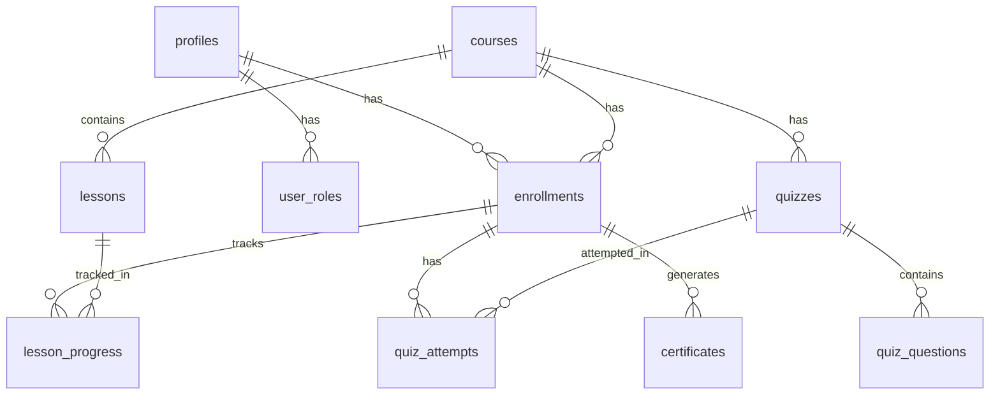

# BUGnBULL - Cloud Security Training Platform

A comprehensive cloud security training and audit platform featuring courses, quizzes, certificates, CLI command reference, and security awareness content.

## 🚀 Features

- **User Authentication** - Firebase Auth with email/password
- **Cloud Security Courses** - Structured lessons with progress tracking
- **Interactive Quizzes** - Score-based assessments with explanations
- **Certificate Generation** - PDF certificates upon course completion
- **CLI Commands Reference** - AWS, Azure, GCP security commands
- **Security Awareness** - Educational articles on cloud security topics
- **Guided Security Audit** - Step-by-step audit workflow
- **Glossary** - Comprehensive security terminology reference
- **Multi-language Support** - English and Hindi
- **Dark/Light Theme** - User preference-based theming
- **PWA Support** - Offline capability and installable
- **Admin Dashboard** - Manage content and users

## 🛠️ Tech Stack

| Category | Technology |
|----------|------------|
| Frontend | React 18, TypeScript, Vite |
| Styling | Tailwind CSS, shadcn/ui (Radix UI) |
| Authentication | Firebase Auth |
| Database | Supabase (PostgreSQL) + Firebase Firestore |
| State Management | TanStack React Query |
| Routing | React Router DOM v6 |
| Charts | Recharts |
| PWA | vite-plugin-pwa |

## 📋 Prerequisites

- Node.js 18+ or Bun
- npm or bun package manager
- Supabase account ([supabase.com](https://supabase.com))
- Firebase account ([firebase.google.com](https://firebase.google.com))

## ⚙️ Environment Variables

Create a `.env` file in the project root:

```env
VITE_SUPABASE_URL=https://your-project-id.supabase.co
VITE_SUPABASE_PUBLISHABLE_KEY=your-supabase-anon-key
VITE_SUPABASE_PROJECT_ID=your-project-id
```

## 🔥 Firebase Configuration

Update the Firebase config in `src/lib/firebase.ts`:

```typescript
const firebaseConfig: FirebaseConfig = {
  apiKey: "YOUR_FIREBASE_API_KEY",
  authDomain: "YOUR_PROJECT.firebaseapp.com",
  projectId: "YOUR_PROJECT_ID",
  storageBucket: "YOUR_PROJECT.firebasestorage.app",
  messagingSenderId: "YOUR_MESSAGING_SENDER_ID",
  appId: "YOUR_APP_ID",
};
```

## 🗄️ Supabase Database Setup

### Tables Required

| Table | Description |
|-------|-------------|
| `profiles` | User profile information |
| `user_roles` | User role assignments (admin/user) |
| `courses` | Training courses |
| `lessons` | Course lessons |
| `enrollments` | User course enrollments |
| `lesson_progress` | Lesson completion tracking |
| `quizzes` | Course quizzes |
| `quiz_questions` | Quiz questions with options |
| `quiz_attempts` | Quiz attempt records |
| `certificates` | Issued certificates |

### Database Schema



### Setup Steps

1. Create a new Supabase project at [supabase.com](https://supabase.com)
2. Go to **SQL Editor** in your Supabase dashboard
3. Run all migration files from `supabase/migrations/` folder in order
4. Run seed data from `public/database-seed.sql`
5. Copy **Project URL** and **anon key** from Settings → API to your `.env` file

### Migration Files

Run these SQL files in order from `supabase/migrations/`:

1. `20250607000000_create_initial_schema.sql` - Base tables
2. `20250607000001_create_profiles_table.sql` - Profiles table
3. `20250607000002_create_user_roles.sql` - User roles and enum
4. `20250607000003_create_courses_tables.sql` - Courses, lessons, quizzes
5. `20250607000004_create_enrollment_tables.sql` - Enrollments and progress
6. `20250607000005_create_certificates_table.sql` - Certificates
7. Additional RLS policy migrations

## 🔥 Firebase Setup Guide

1. Go to [Firebase Console](https://console.firebase.google.com)
2. Create a new project
3. **Enable Authentication:**
   - Go to Authentication → Sign-in method
   - Enable **Email/Password** provider
4. **Enable Firestore:**
   - Go to Firestore Database
   - Create database in production mode
   - Set up security rules:
   ```javascript
   rules_version = '2';
   service cloud.firestore {
     match /databases/{database}/documents {
       match /users/{userId} {
         allow read, write: if request.auth != null && request.auth.uid == userId;
       }
     }
   }
   ```
5. **Get Config:**
   - Go to Project Settings → General
   - Scroll to "Your apps" → Web app
   - Copy the config object
6. Update `src/lib/firebase.ts` with your config

## 📦 Installation

```bash
# Clone the repository
git clone <your-repo-url>
cd bugnbull

# Install dependencies
npm install
# or
bun install

# Start development server
npm run dev
# or
bun dev

# Build for production
npm run build
```

## 🌐 Hostinger Deployment

### Step 1: Build the Project

```bash
npm run build
```

This creates a `dist/` folder with production files.

### Step 2: Upload to Hostinger

1. Log in to Hostinger hPanel
2. Go to **File Manager**
3. Navigate to `public_html` folder
4. Delete existing files (if any)
5. Upload all contents from the `dist/` folder

### Step 3: Configure .htaccess

Create or update `.htaccess` in `public_html`:

```apache
<IfModule mod_rewrite.c>
  RewriteEngine On
  RewriteBase /
  
  # Handle Authorization Header
  RewriteCond %{HTTP:Authorization} .
  RewriteRule .* - [E=HTTP_AUTHORIZATION:%{HTTP:Authorization}]
  
  # Redirect Trailing Slashes If Not A Folder
  RewriteCond %{REQUEST_FILENAME} !-d
  RewriteCond %{REQUEST_URI} (.+)/$
  RewriteRule ^ %1 [L,R=301]
  
  # Handle Front Controller
  RewriteRule ^index\.html$ - [L]
  RewriteCond %{REQUEST_FILENAME} !-f
  RewriteCond %{REQUEST_FILENAME} !-d
  RewriteRule . /index.html [L]
</IfModule>

# Enable CORS
<IfModule mod_headers.c>
  Header set Access-Control-Allow-Origin "*"
  Header set Access-Control-Allow-Methods "GET, POST, PUT, DELETE, OPTIONS"
  Header set Access-Control-Allow-Headers "Content-Type, Authorization"
</IfModule>

# Cache static assets
<IfModule mod_expires.c>
  ExpiresActive On
  ExpiresByType image/jpg "access plus 1 year"
  ExpiresByType image/jpeg "access plus 1 year"
  ExpiresByType image/gif "access plus 1 year"
  ExpiresByType image/png "access plus 1 year"
  ExpiresByType image/svg+xml "access plus 1 year"
  ExpiresByType text/css "access plus 1 month"
  ExpiresByType application/javascript "access plus 1 month"
</IfModule>
```

### Step 4: SSL Certificate

1. Go to Hostinger hPanel → SSL
2. Install free SSL certificate
3. Enable "Force HTTPS" redirect

## 📁 Project Structure

```
bugnbull/
├── public/
│   ├── database-seed.sql     # Sample course data
│   ├── favicon.png
│   ├── pwa-192x192.png
│   └── robots.txt
├── src/
│   ├── assets/               # Images and static assets
│   │   ├── awareness/        # Awareness article images
│   │   ├── logo-dark.png
│   │   └── logo-light.png
│   ├── components/
│   │   ├── admin/            # Admin dashboard components
│   │   ├── audit/            # Guided audit components
│   │   ├── auth/             # Auth components (Login, ProtectedRoute)
│   │   ├── awareness/        # Awareness article components
│   │   ├── certificate/      # Certificate generation
│   │   ├── courses/          # Course listing and details
│   │   ├── glossary/         # Glossary term cards
│   │   ├── hero/             # Landing page hero section
│   │   ├── layout/           # App layout, navigation
│   │   ├── pwa/              # PWA install prompts
│   │   ├── quiz/             # Quiz components
│   │   └── ui/               # shadcn/ui components
│   ├── contexts/
│   │   ├── AdminAuthContext.tsx
│   │   ├── FirebaseAuthContext.tsx  # Main auth context
│   │   └── UserAuthContext.tsx
│   ├── data/
│   │   ├── auditContent.ts   # Audit checklist data
│   │   ├── cliCommands.ts    # CLI commands reference
│   │   ├── faqContent.ts     # FAQ content
│   │   └── glossaryContent.ts
│   ├── hooks/
│   │   ├── useCourses.ts     # Course data hooks
│   │   ├── useQuiz.ts        # Quiz logic hooks
│   │   └── use-mobile.tsx
│   ├── i18n/
│   │   ├── LanguageContext.tsx
│   │   └── translations/     # EN/HI translations
│   ├── integrations/
│   │   └── supabase/
│   │       ├── client.ts     # Supabase client
│   │       └── types.ts      # Database types
│   ├── lib/
│   │   ├── firebase.ts       # Firebase configuration
│   │   └── utils.ts          # Utility functions
│   ├── pages/
│   │   ├── AdminDashboard.tsx
│   │   ├── Awareness.tsx
│   │   ├── Certificate.tsx
│   │   ├── CLICommands.tsx
│   │   ├── CourseDetail.tsx
│   │   ├── Courses.tsx
│   │   ├── FAQ.tsx
│   │   ├── Glossary.tsx
│   │   ├── GuidedAudit.tsx
│   │   ├── Index.tsx         # Dashboard
│   │   ├── Landing.tsx       # Homepage
│   │   ├── LessonView.tsx
│   │   ├── Login.tsx
│   │   ├── MyLearning.tsx
│   │   ├── Profile.tsx
│   │   ├── QuizView.tsx
│   │   └── Signup.tsx
│   ├── App.tsx
│   ├── index.css             # Global styles & design tokens
│   └── main.tsx
├── supabase/
│   ├── config.toml           # Supabase config
│   └── migrations/           # SQL migration files
├── .env                      # Environment variables
├── index.html
├── tailwind.config.ts
├── vite.config.ts
└── package.json
```

## 🔐 Authentication Flow

1. **User signs up** → Firebase creates auth user
2. **Profile syncs** → Firebase Auth → Firestore + Supabase profiles table
3. **Login** → Firebase Auth verifies credentials
4. **Protected routes** → Check Firebase auth state
5. **Data access** → Supabase with Firebase user ID

## 👤 Creating Admin Users

After a user signs up, manually add admin role in Supabase:

```sql
-- Replace 'firebase-user-id' with actual Firebase UID
INSERT INTO public.user_roles (user_id, role)
VALUES ('firebase-user-id', 'admin');
```

Or update existing user:

```sql
UPDATE public.user_roles
SET role = 'admin'
WHERE user_id = 'firebase-user-id';
```

## 🛡️ Security Notes

- **RLS Enabled** - All tables have Row Level Security policies
- **Firebase Auth** - Handles user authentication
- **Role-based Access** - Separate `user_roles` table (not in profiles)
- **Profile Sync** - Profiles sync between Firebase and Supabase
- **No sensitive data in client** - API keys are publishable only

## 🐛 Troubleshooting

### CORS Issues with Supabase

Ensure your domain is added to Supabase allowed origins:
1. Go to Supabase → Authentication → URL Configuration
2. Add your Hostinger domain to "Redirect URLs"

### Firebase Auth Errors

- Verify Firebase config is correct
- Check if Email/Password provider is enabled
- Ensure domain is authorized in Firebase Console → Authentication → Settings

### Profile Not Syncing

Check browser console for errors. The `FirebaseAuthContext` should:
1. Create/update Firestore document
2. Upsert Supabase profile

### SPA Routing Not Working

Ensure `.htaccess` file exists in `public_html` with correct rewrite rules.

### Quiz/Course Data Not Loading

1. Verify Supabase connection
2. Check RLS policies allow SELECT
3. Run seed data SQL if tables are empty

## 📄 License

This project is proprietary. All rights reserved.

## 👥 Support

For issues and feature requests, please contact the development team.

---

**Built with ❤️ by BUGnBULL Team**
